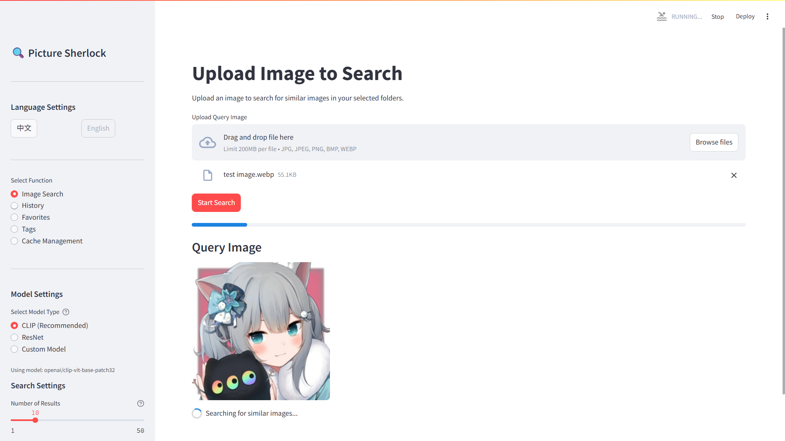
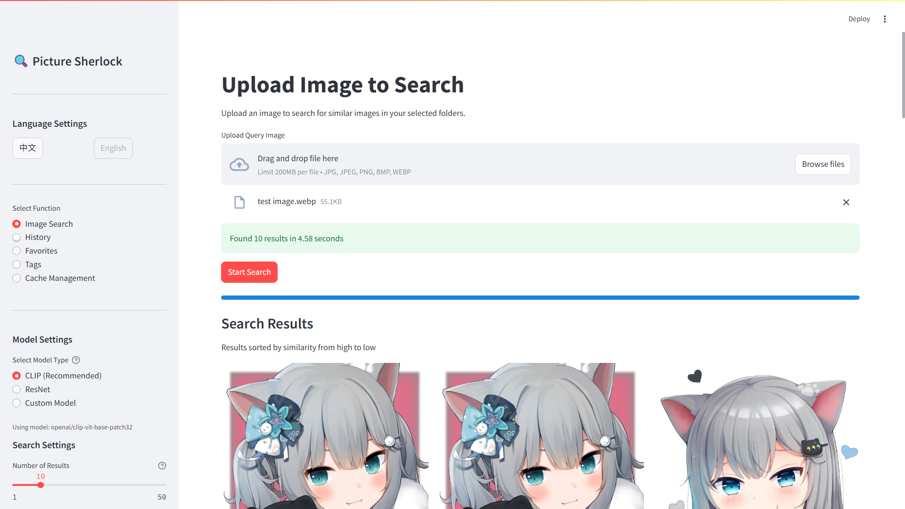
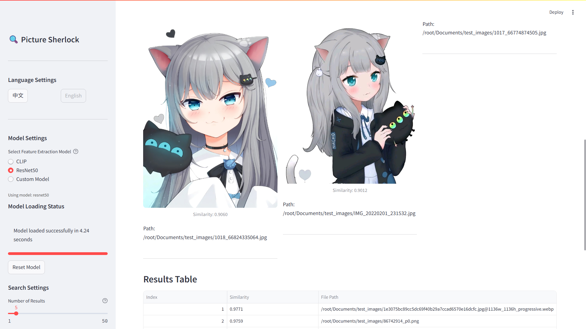
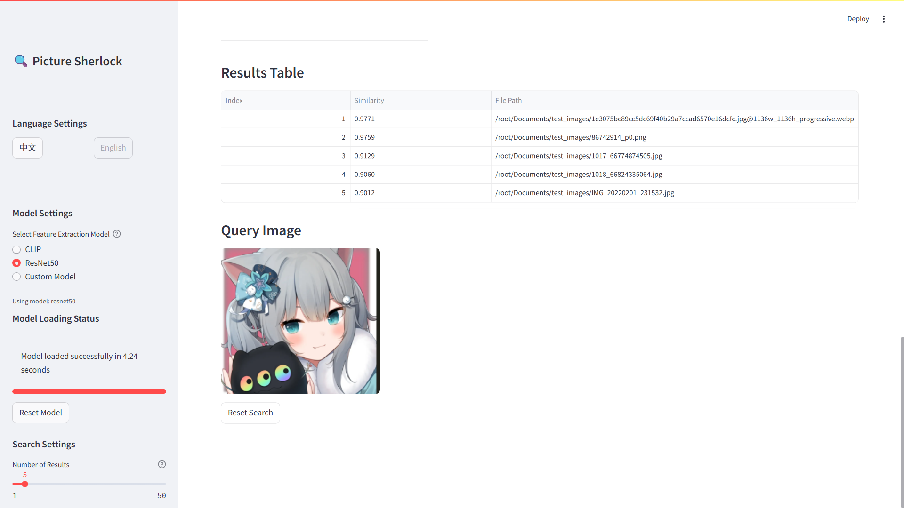

<div align="center">
    English | <a href="README_ZH-CN.md">简体中文</a>
</div>


# 📚 Picture Sherlock

[](https://github.com/CN-Scars/picture_sherlock/releases/latest)
[](/LICENSE)

## 🚀 Project Overview

Picture Sherlock is a deep learning-based image comparison tool that rapidly identifies similar images within a large collection by analyzing image features. The tool utilizes pre-trained neural network models (such as ResNet, VGG, etc.) to extract image features and employs vector similarity calculation methods (like cosine similarity) for precise matching.









## ✨ Features

- 🖼️ Upload reference images and search for similar images in specified folders
- 🔍 Support for multiple similarity calculation methods (Euclidean distance, cosine similarity, etc.)
- ⚙️ Customizable result quantity
- 🌐 Bilingual interface with English and Chinese language options
- 📊 Similarity percentage scoring and visualization
- 📁 Support for various image formats (JPG, PNG, WEBP, etc.)

## 🔧 System Requirements

- 🐍 **Python 3.7** or higher
- 🖥️ **CUDA support** (optional but recommended): Using a GPU with CUDA support can significantly speed up feature extraction. If using GPU inference, please install CUDA and cuDNN, and ensure the Pytorch version is compatible with the CUDA version.
- 💾 Anaconda or virtualenv environment recommended
- 📦 Dependencies specified in `requirements.txt`

## 💻 Installation Steps

### 1. Clone the Repository

```bash
git clone https://github.com/CN-Scars/image-similarity-search.git
cd image-similarity-search
```

### 2. Set Python Interpreter Path (Required for Quick Start)

Rename the `.env-example` file in the project root directory to `.env` and set the `PYTHON_PATH` variable to your Python interpreter path:

```
# Examples:
PYTHON_PATH=%USERPROFILE%\.conda\envs\picture_sherlock\python.exe  # Windows
PYTHON_PATH="$HOME/anaconda3/envs/picture_sherlock/bin/python3"  # Linux/Mac
```

If not set, the startup script will prompt you to enter it when first run.

### 3. Create and Activate a Virtual Environment

Using `venv`:

```bash
python -m venv venv
source venv/bin/activate  # Linux/Mac
venv\Scripts\activate  # Windows
```

Or using Anaconda:

```bash
conda create -n picture_sherlock python=3.9
conda activate picture_sherlock
```

### 4. Install Dependencies (or automatically installed when using the one-click start script)

```bash
pip install -r requirements.txt
```

## 📦 Usage

### Quick Start (Recommended)

1. Windows:
   - Run `run_app_en.ps1` on PowerShell to start the application
   
2. Linux/Mac:
   - Grant execution permissions: `chmod +x run_app_en.sh`
   - Run: `./run_app_en.sh`

### Manual Start

Launch the Streamlit app:

```bash
streamlit run picture_sherlock/app.py -- --lang en
```

Open your browser and visit [http://localhost:8501](http://localhost:8501/) to use the application.

## 📝 Usage Steps

1. After launching, your browser will automatically open the application interface (default port: 8501)
2. Select language and model from the sidebar (choose models prioritizing speed or accuracy as needed)
3. Upload a reference image (drag & drop supported)
4. Select the folder to search
5. Set search parameters (maximum results, etc.)
6. Click the "Start Search" button
7. View the results list with similarity scores

## 🤝 Contributions

Issues and pull requests are welcome to help improve this project.

## 📝 License

[MIT](https://github.com/CN-Scars/picture_sherlock/blob/main/LICENSE)

------

If you have any questions, feel free to reach out!

<div align="center">
    <p><strong>Picture Sherlock</strong></p> English | <a href="README_ZH-CN.md">简体中文</a>
</div>
