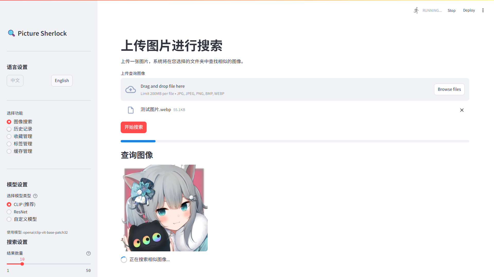
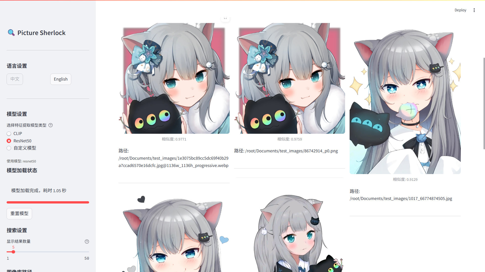

<div align="center">
    <a href="README.md">English</a> | 简体中文
</div>


# 📚 Picture Sherlock

[](https://github.com/CN-Scars/picture_sherlock/releases/latest)
[](/LICENSE)

## 🚀 项目简介

Picture Sherlock是一个基于深度学习的图像相似度比较工具，能够通过分析图像特征，在大量图片集合中快速找到与目标图像相似的图片。该工具利用预训练的神经网络模型（如CLIP、ResNet50等）提取图像特征，并使用余弦相似度计算方法进行精准匹配。





## ✨ 功能特性

- 🖼️ 上传参考图片，在指定文件夹中搜索相似图像
- 🔍 先进的余弦相似度计算，实现精准图像匹配
- 🤖 多种AI模型支持：CLIP（语义理解）、ResNet50（视觉特征）和自定义Hugging Face模型
- ⚙️ 可自定义显示结果数量和搜索参数
- 🌐 支持中英双语界面切换
- 📊 提供相似度百分比评分和可视化展示
- 📁 支持多种图像格式（JPG、PNG、WEBP、BMP）
- 📝 **搜索历史记录**：自动保存搜索历史，支持标签、备注和收藏功能
- 🏷️ **标签管理**：通过完整的标签系统组织和分类搜索记录
- 📈 **统计分析**：提供搜索频率、模型使用情况和标签使用统计
- 💾 **数据管理**：支持历史记录的导入导出和备份恢复

## 🔧 系统要求

- 🐍 **Python 3.7** 或更高版本
- 🖥️ **CUDA支持**：虽然不是必需的，但使用支持CUDA的NVIDIA GPU可以显著提高特征提取速度。若使用GPU推理，请安装CUDA和cuDNN，并确保安装的Pytorch版本与CUDA版本兼容。
- 💾 建议使用 Anaconda 或 virtualenv 创建独立环境
- 📦 `requirements.txt` 中指定的依赖项

## 💻 安装步骤

### 1. 克隆仓库

```bash
git clone https://github.com/CN-Scars/picture_sherlock.git
cd picture_sherlock
```

### 2. 设置Python解释器路径（使用一键启动时需要）

重命名项目根目录下的`.env-example`文件为`.env`，并设置`PYTHON_PATH`变量为您的Python解释器路径：

```
# 例如：
PYTHON_PATH=%USERPROFILE%\.conda\envs\picture_sherlock\python.exe  # Windows
PYTHON_PATH="$HOME/anaconda3/envs/picture_sherlock/bin/python3"  # Linux/Mac
```

如果不设置，启动脚本会在首次运行时提示您输入。

### 3. 创建并激活虚拟环境

使用 `venv`：

```bash
python -m venv venv
source venv/bin/activate  # Linux/Mac
venv\Scripts\activate  # Windows
```

或者使用 Anaconda：

```bash
conda create -n picture_sherlock python=3.9
conda activate picture_sherlock
```

### 4. 安装依赖项（或者在使用一键启动脚本时会自动安装）

```bash
pip install -r requirements.txt
```

## 📦 使用方法

### 一键启动（推荐）

1. Windows系统:
   - 在PowerShell中运行 `run_app_zh.ps1` 启动应用
2. Linux/Mac系统:
   - 授予执行权限： `chmod +x run_app_zh.sh`
   - 运行： `./run_app_zh.sh`

### 手动启动

启动 Streamlit 应用：

```bash
streamlit run picture_sherlock/app.py -- --lang zh
```

打开浏览器访问 [http://localhost:8501](http://localhost:8501/)，即可使用应用程序。

## 📝 使用步骤

1. 启动程序后，浏览器将自动打开应用界面（默认端口：8501）

2. 通过左侧边栏选择语言和模型（可根据需求选择速度或准确度优先的模型）

3. 上传参考图片（支持拖放操作）

4. 选择要搜索的文件夹

5. 设置搜索参数（最大结果数）

6. 点击"开始搜索"按钮

7. 查看结果列表和相似度评分

## 🤝 贡献

欢迎提交问题和拉取请求以帮助改进该项目。

## 📝 许可证

[MIT](https://github.com/CN-Scars/picture_sherlock/blob/main/LICENSE)

------

如果您有任何问题，欢迎随时联系！

<div align="center">
    <p><strong>Picture Sherlock</strong></p> <a href="README.md">English</a> | 简体中文
</div>